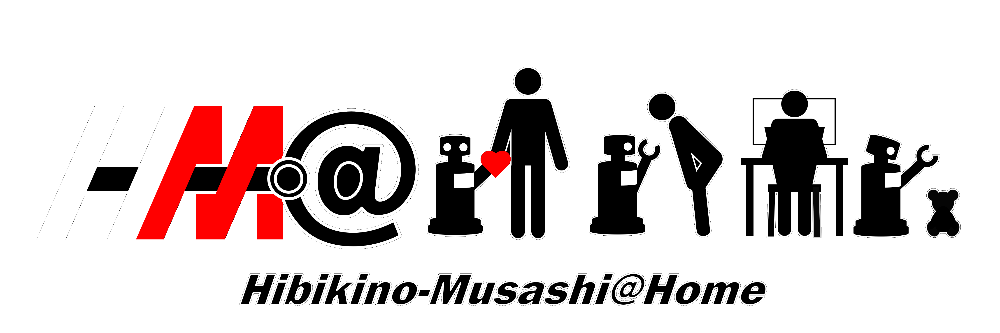

<div align="center">
  
  <div align="center">
    <a href="https://www.brain.kyutech.ac.jp/~hma/">
      <b><font size="5">Hibikino-Musashi@Home website</font></b>
    </a>
  </div><br><br>
  &nbsp;&nbsp;
  
</div>
<br>

# Introduction
This repository is the development workspace for the [WRS Simulator](https://github.com/hsr-project/tmc_wrs_docker) at Hibikino-Musashi@Home.

It contains the source code that won 2nd place at [RoboCup 2021 Worldwide](https://athome.robocup.org/rc2021/) and 1st place at [RoboCup Asia-Pacific 2021](https://robocupap.org/robocuphome/).

It also contains a part of the 1st place source code at the [World Robot Summit 2020 Partner Robot Challenge (Real Space)](https://wrs.nedo.go.jp/wrs2020/challenge/service/partner.html).

## Execution video
[](https://www.youtube.com/watch?v=DRKtSZEgaNQ)

# Installation
Please perform the docker installation described in the [WRS Simulator](https://github.com/hsr-project/tmc_wrs_docker) in advance.

## Clone repository and Build workspace
```
$ mkdir -p ~/ros_ws/hma && cd ~/ros_ws/hma
$ git clone --recursive https://github.com/Hibikino-Musashi-Home/hma_wrs_sim_ws.git
$ catkin build
```

## Download weights for object recognition 
```
$ cd ~/ros_ws/hma/hma_wrs_sim_ws
$ sh get_weights.sh
```

# Usage
## 1. Starting the simulator
```
cd ~/ros_ws/hma/hma_wrs_sim_ws/src/04_sim_docker/hsrb_robocup_dspl_docker
docker-compose -f docker-compose.nvidia.yml up
```
After starting the simulator, access to [http://localhost:3000/](http://localhost:3000/) and press the Start button (▷) on the simulator.

## 2. Executing the program
## i. with docker
```
$ cd ~/ros_ws/hma/hma_wrs_sim_ws
$ docker build . -t hma_wrs_sim_ws
$ sh docker-run
$ source /opt/ros/melodic/setup.bash && cd ~/ros_ws/hma/hma_wrs_sim_ws && catkin build
$ source ~/ros_ws/hma/cv_bridge_ws/install/setup.bash --extend && source ~/ros_ws/hma/hma_wrs_sim_ws/devel/setup.bash
$ sh ~/ros_ws/hma/hma_wrs_sim_ws/scripts/exec_all.sh
```

## ii. without docker
```
$ cd ~/ros_ws/hma/hma_wrs_sim_ws
$ sh scripts/exec_all.sh
```

# License
This software is released under the BSD 3-Clause Clear License, see [LICENSE](https://github.com/Hibikino-Musashi-Home/hma_wrs_sim_ws/blob/master/LICENSE).