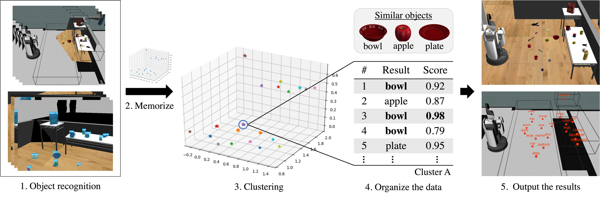

# mapping_object_server
<br>

This action server provides the function of mapping objects in a designated area for strategic tidy-up.

## Interfaces
### Parameters
**~area_data_path (str)**

Specify the path to the JSON file containing information on the area to be mapped.

The JSON file should be written in the following format.
```json
{
    "PLACE_NAME":{
        "min":{
            "x": value (float),
            "y": value (float),
            "z": value (float)
        },
        "max":{
            "x": value (float),
            "y": value (float),
            "z": value (float)
        }
    }
}
```
An example JSON file can be found [here](https://github.com/Hibikino-Musashi-Home/hma_wrs_sim_ws/blob/review/src/01_common/hma_common/hma_common_pkg/io/mapping_area/area.json).

Defaults to `"hma_common_pkg/io/mapping_area/area.json"`.

**~select_mode (int)**

Select the method to calculate one final recognition result from multiple recognition results.

Two methods are available. 
- When the input is "1", the most frequent ID is the final recognition result. 
- When the input is "2", the highest score's ID is the final recognition result.

Defaults to `0`.

**~frame (str)**

The frame name used for mapping.

Defaults to `"map"`.

### Published topics
**area ([visualization_msgs/Marker.msg](http://docs.ros.org/en/api/visualization_msgs/html/msg/Marker.html))**

Publish markers for visualization of the specified area.

**points ([visualization_msgs/Marker.msg](http://docs.ros.org/en/api/visualization_msgs/html/msg/Marker.html))**

Publish markers for visualization indicating the location of mapping　objects.

**text ([visualization_msgs/Marker.msg](http://docs.ros.org/en/api/visualization_msgs/html/msg/Marker.html))**

Publish markers for visualization indicating the name of mapping　objects.

### Action servers
**mapping_object ([hma_common_action/MappingObjectAction](https://github.com/Hibikino-Musashi-Home/hma_wrs_sim_ws/blob/review/src/01_common/hma_common/hma_common_action/action/MappingObject.action))**

This action server provides various functions such as adding objects, performing mappings, and referencing objects.

The required arguments and return values for the action are as follows.
- Args
    - action (int): Select the action to be executed. Select from MappingAction.[ADD, MAPPING, DELETE, DELETEALL, CHECK, GET, GETALL, GETNEAREST]
        - ADD: Add objects.
        - MAPPING: Run the mapping and save the data.
        - DELETE: Delete specific object from the mapping data.
        - DELETEALL: Delete all objects from the mapping data.
        - CHECK: Check for the existence of an object in the mapping data, and if it exists, compare the scores and return the higher one.
        - GET: Get a specific object from the mapping data.
        - GETALL: Get all objects from the mapping data.
        - GETNEAREST: Get nearest object from the mapping data.
    - id (list[str], optional): object ID.
        Required for ADD, CHECK. Defaults to `""`.
    - name (list[str], optional): object name.
        Required for ADD. Defaults to `""`.
    - pose (list[[geometry_msgs/Pose](http://docs.ros.org/en/noetic/api/geometry_msgs/html/msg/Pose.html)], optional): 3D coordinates of a specific object.
        Required for ADD, DELETE, CHECK, GETNEAREST. Defaults to `Pose()`.
    - score (list[float], optional): Recognition score of a comparison objects.
        Required for ADD, CHECK. Defaults to `0.0`.
    - search_place (str, optional): Limit the search area.
        Optional for ADD, DELETE, CHECK, GETNEAREST. Defaults to `""`.

- Returns
    - [hma_common_action/MappingObjectResult](https://github.com/Hibikino-Musashi-Home/hma_wrs_sim_ws/blob/review/src/01_common/hma_common/hma_common_action/action/MappingObject.action): Results for each action.