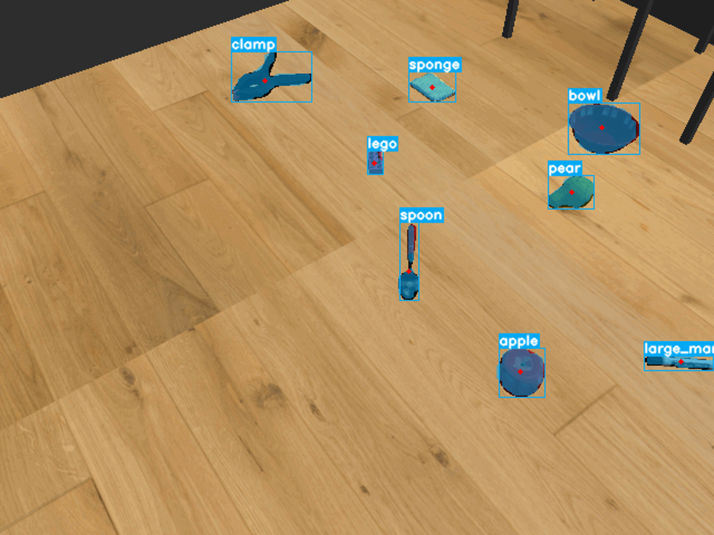

# yolact_server
<br>
This action server provides the function to perform object detection using YolactEdge.

## Interfaces
### Parameters
**~action_name (str)**
The name of the action to be executed can be specified.

Use this parameter when you want to activate multiple recognizers.

Defaults to `"/yolact"`.

**~use_gpu (bool)**

The setting for whether to use the GPU or not.

Defaults to `True`.

**~cfg (str)**

The setting for YolactEdge config name.

Defaults to `"yolact_edge_pytorch_config"`.

**~weight (str)**

The model uses for recognition.

Defaults to `"hma_yolact_pkg/io/weights/yolact_edge_54_800000.pth"`.

**~th (float)**

The threshold uses for recognition.

Results below the threshold are ignored.

Defaults to `0.1`.

**~top_k (int)**

The maximum number of recognitions.

The results are ordered by score, with results below the specified number ignored.

Defaults to `30`.

**~nms_th (float)**

The IoU threshold uses for NMS.

Results below the threshold are ignored.

Defaults to `0.5`.

**~area_size_range/min (int)**

The minimum size of the area to be recognized.

Results with an area less than the specified value are ignored.

Defaults to `-1`.

**~area_size_range/max (int)**
The maximum size of the area to be recognized.

Results with an area more than the specified value are ignored.

Defaults to `np.inf`.

**~use_d (bool)**

Specify whether the depth images are acquired simultaneously.

Defaults to `True`.

**~rgb (str)**

The topic name of the RGB image.

Defaults to `"/camera/rgb/image_raw"`.

**~d (str)**

The topic name of the depth image.

Defaults to `"/camera/depth_registered/image_raw"`.

**~camera_info (str)**

The topic name of the camera information.

Defaults to `"/camera/depth_registered/camera_info"`.

**~get_pose (bool)**

Specify whether to get the 3D coordinates of the recognized object.

Defaults to `False`.

**~frame (str)**

The camera frame name.

Defaults to `/camera_frame`.

**~max_distance (float)**

The maximum distance to be recognized.

Results beyond the maximum distance are ignored, and the resulting image is blacked out.

Valid only when `use_d` is `True`.

Defaults to `-1.0`.

**~specific_id (str)**

Specify a specific ID to be recognized.

Results other than the specified ID will be ignored.

To specify more than one, do the following.
```
"A, B, C" (Please put a space after the ",".)
```

Defaults to `""`.

**~ignore_id (str)**

Specify a ignore ID to be recognized.

To specify more than one, do the following.
```
"A, B, C" (Please put a space after the ",".)
```

Defaults to `""`.

**~show_name (bool)**

The name, not the ID, is displayed on the published image for visualization.

The name refers to the "show_name" listed in the config.

Defaults to `False`.

### Published topics
**~dbg/rgb ([sensor_msgs/Image.msg](https://docs.ros.org/en/api/sensor_msgs/html/msg/Image.html))**

Publish the result image for visualization.

**~dbg/d ([sensor_msgs/Image.msg](https://docs.ros.org/en/api/sensor_msgs/html/msg/Image.html))**

Publish the depth image for visualization.

**~dbg/mask ([sensor_msgs/Image.msg](https://docs.ros.org/en/api/sensor_msgs/html/msg/Image.html))**

Publish the result mask image for visualization.

**~yolact_without_pose ([hma_yolact_msgs/YolactWithoutPose.msg](https://hibikino-musashi-home.github.io/hma_wrs_sim_ws/src/01_common/hma_yolact/hma_yolact_msgs/msg/YolactWithoutPose.html))**

Publish recognition results.

**~yolact_with_pose ([hma_yolact_msgs/YolactWithPose.msg](https://hibikino-musashi-home.github.io/hma_wrs_sim_ws/src/01_common/hma_yolact/hma_yolact_msgs/msg/YolactWithPose.html))**

Publish recognition results with the 3D pose.

Publish when the `~use_d` and `~get_pose` parameters are `True`.

### Subscribed topics
**camera/rgb/image_raw ([sensor_msgs/Image.msg](https://docs.ros.org/en/api/sensor_msgs/html/msg/Image.html))**

Subscribe to the rgb image.

Subscribe when the `~use_d` parameter is `False`.

The topic name is changed by the `~rgb` parameter.

**camera/depth_registered/image_raw ([sensor_msgs/Image.msg](https://docs.ros.org/en/api/sensor_msgs/html/msg/Image.html))**

Subscribe to the depth image.

Subscribe when the `~use_d` parameter is `True`.

It obtains synchronized with the RGB image.

The topic name is changed by the `~d` parameter.

**camera/depth_registered/camera_info ([sensor_msgs/CameraInfo.msg](http://docs.ros.org/en/noetic/api/sensor_msgs/html/msg/CameraInfo.html))**

Subscribe to the camera information.

Subscribe only once for the first time.

The topic name is changed by the `~camera_info` parameter.


### Action servers
**yolact ([hma_yolact_action/YolactAction](https://hibikino-musashi-home.github.io/hma_wrs_sim_ws/src/01_common/hma_yolact/hma_yolact_action/action/Yolact.html))**

This action server provides a function to recognize objects.

The action name is changed by the `~action_name` parameter.