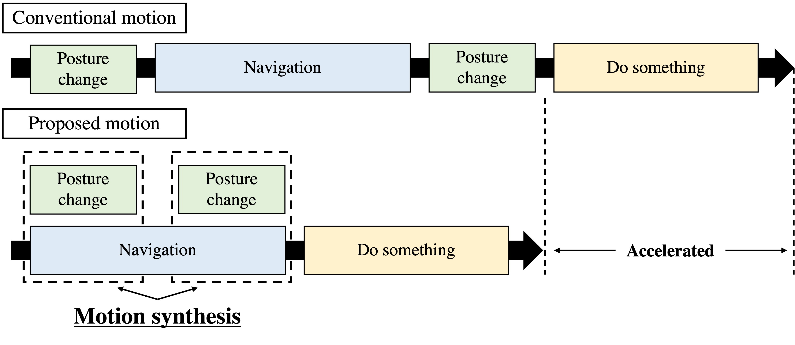

# motion_synthesis_server
 
This node provides the function of navigation and posture transition simultaneously.

## Interfaces
### Action servers
**motion_synthesis ([hma_hsr_nav_action/MotionSynthesisAction]())**

This action server provides the function for motion synthesis.