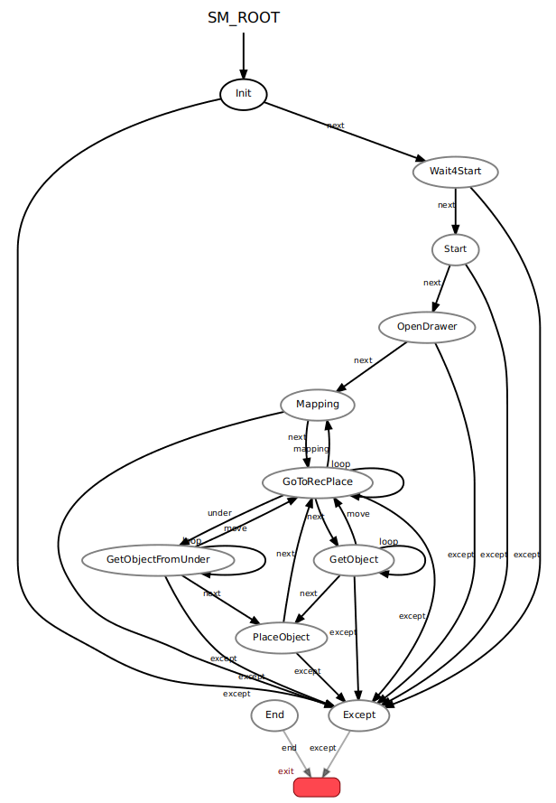

# sm_cu_node
This node provides the state machine's function to execute the Clean Up task.

## State machine
 
This state machine consists of the following states.

- Init: Initialize state.
- Wait4Start: Wait for start state.
- Start: Start state.
- OpenDrawer: Open drawer state.
- Mapping: Mapping object state.
- GoToRecPlace: Go to recognition place state.
- GetObject: Get object state.
- GetObjectFromUnder: Get object from under the table state.
- PlaceObject: Place object to deposit place state.
- End: End state.
- Except: Except state.
- Exit: Exit state.