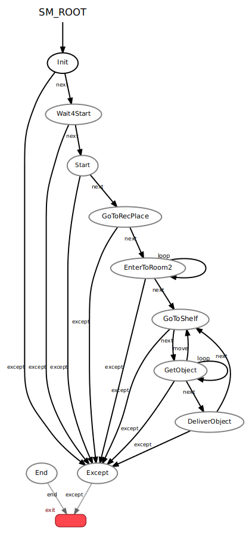

# sm_gg_node
This node provides the state machine's function to execute the Go and Get it task.

## Overview
 
This state machine consists of the following states.

- Init: Initialize state.
- Wait4Start: Wait for start state.
- Start: Start state.
- GoToRecPlace: Go to recognition place state.
- EnterToRoom2: Enter to Room 2 state.
- GoToShelf: Go to shelf state.
- GetObject: Get object from the shelf state.
- DeliverObject: Deliver the object to designated person state.
- End: End state.
- Except: Except state.
- Exit: Exit state.